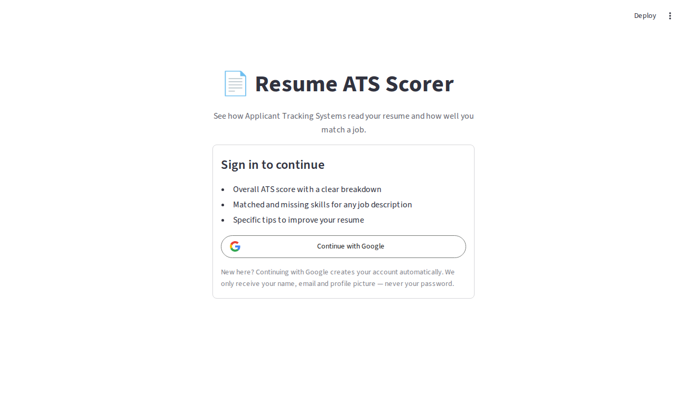
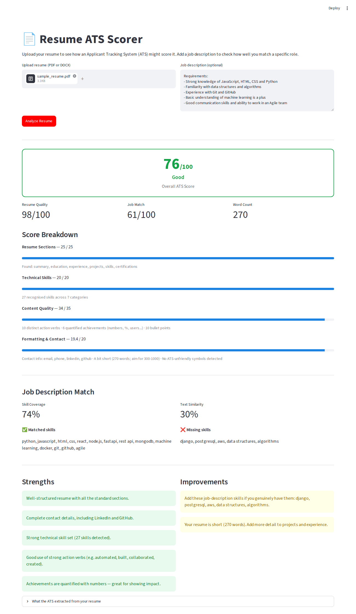

# 📄 Resume ATS Scorer

A web app that scores a resume the way an **Applicant Tracking System (ATS)** might. It also measures how well the resume matches a specific job description.

Upload a PDF or DOCX resume and, optionally, paste a job description. You get:

- an **overall ATS score (0–100)** with a clear breakdown of every point
- **matched and missing skills** compared with the job description
- specific **strengths** and **improvements** to act on

Built with **FastAPI** (REST API backend), **Streamlit** (frontend) and **scikit-learn** (TF-IDF text similarity). Users sign in with their **Google account** before they can use the scorer. The resume analysis itself runs locally and needs no paid API.

| Sign in | Results |
|---|---|
|  |  |

---

## ✨ Features

- **Google Sign-In (mandatory)**: "Continue with Google" sign-up and sign-in. The scorer is locked until you sign in, and the backend verifies every request
- **Resume upload**: PDF and DOCX, with size, type and file-signature validation
- **Text extraction**: reads text, tables and hyperlinks (LinkedIn/GitHub links)
- **Resume parsing**: detects sections, contact details, 100+ technical skills (with aliases such as `ReactJS → react`), action verbs, quantified achievements and weak phrases
- **Transparent scoring**: four categories with notes that explain how each score was calculated
- **Job description matching**: skill coverage plus TF-IDF cosine similarity, with a list of missing skills
- **Actionable feedback**: strengths and improvements generated from the analysis
- **REST API** with auto-generated docs at `/docs`
- **Automated tests** with pytest
- *(Optional)* **AI suggestions** from an LLM (Groq / Llama 3) if you add an API key

## 🛠 Tech Stack

| Layer        | Technology                                  |
|--------------|---------------------------------------------|
| Frontend     | Streamlit                                   |
| Backend      | FastAPI, Uvicorn, Pydantic                  |
| File parsing | pdfplumber (PDF), python-docx (DOCX)        |
| NLP / ML     | scikit-learn (TF-IDF + cosine similarity), regex |
| Auth         | Google Sign-In (OpenID Connect) via `st.login`, `google-auth` token verification, SQLite user store |
| Testing      | pytest, FastAPI TestClient                  |
| Optional AI  | Groq API (Llama 3)                          |

---

## 🚀 Getting Started

### Prerequisites
- Python 3.10 or newer
- Git

### 1. Clone the repository
```bash
git clone https://github.com/aakashcse/ai-resume-ats.git
cd ai-resume-ats
```

### 2. Create and activate a virtual environment
```bash
python -m venv venv

# Windows
venv\Scripts\activate
# macOS / Linux
source venv/bin/activate
```

### 3. Install dependencies
```bash
pip install -r requirements.txt
```

### 4. Set up Google Sign-In (required)
You need a free OAuth client from Google. This takes about 5 minutes. Follow the steps in **[Authentication setup](#-authentication-setup)** below, then:

```bash
cp .env.example .env                                   # Windows: copy .env.example .env
cp .streamlit/secrets.toml.example .streamlit/secrets.toml
```
- In `.env`, set `GOOGLE_CLIENT_ID`.
- In `.streamlit/secrets.toml`, set `client_id`, `client_secret` and a random `cookie_secret`. Generate the secret with `python -c "import secrets; print(secrets.token_hex(32))"`.

Both files are in `.gitignore`. **Never commit them.**

*(Optional)* Add a `GROQ_API_KEY` to `.env` (and run `pip install groq`) if you want AI suggestions.

### 5. Start the backend (terminal 1)
Run this from the **project root**:
```bash
uvicorn backend.main:app --reload
```
The API runs at http://localhost:8000, and the interactive docs are at http://localhost:8000/docs.

### 6. Start the frontend (terminal 2, with the venv activated)
```bash
streamlit run frontend/app.py
```
The app opens at http://localhost:8501.

### 7. Try it
Click **Continue with Google** and choose your account. The first time, your account is created automatically. Then upload `sample_data/sample_resume.pdf` and paste the text from `sample_data/sample_job_description.txt`.

### Run the tests
```bash
pytest
```

---

## 📁 Project Structure

```
ai-resume-ats/
├── backend/
│   ├── main.py                 # FastAPI app: /health, /auth/me and /analyze endpoints
│   ├── auth.py                 # Verifies Google ID tokens (protects the API)
│   ├── users.py                # SQLite user store (sign up on first login)
│   ├── config.py               # All settings and scoring weights in one place
│   ├── schemas.py              # Pydantic models for the API responses
│   ├── data/
│   │   └── keywords.py         # Skills, aliases, action verbs, section headings
│   └── services/
│       ├── text_extractor.py   # 1. Validate file + extract text (PDF/DOCX)
│       ├── resume_parser.py    # 2. Find sections, contact, skills, verbs, metrics
│       ├── jd_matcher.py       # 3. Compare resume with job description
│       ├── scorer.py           # 4. Calculate category scores + final score
│       ├── feedback.py         # 5. Generate strengths and improvements
│       ├── ai_suggestions.py   # Optional LLM tips (Groq)
│       └── analyzer.py         # Runs steps 2–5 as one pipeline
├── frontend/
│   ├── app.py                  # Streamlit UI that calls the backend API
│   └── auth_ui.py              # Sign-in page, account sidebar, sign-out
├── .streamlit/
│   └── secrets.toml.example    # Google OAuth settings template for Streamlit
├── tests/                      # pytest tests (parser, scoring, API, auth)
├── sample_data/                # Sample resume (PDF + DOCX) and job description
├── docs/                       # Screenshots + build guide
├── requirements.txt
├── .env.example
└── README.md
```

## ⚙️ How It Works

```
Sign in with Google ─► Upload ─► text_extractor ─► resume_parser ─► jd_matcher (optional) ─► scorer ─► feedback ─► JSON ─► Streamlit UI
```

### Resume quality score (out of 100)

| Category               | Points | What is checked |
|------------------------|:------:|-----------------|
| Resume Sections        | 25 | Education, Skills, Projects, Experience (5 each), Summary (3), Certifications (2) |
| Technical Skills       | 20 | 1 pt per recognised skill (max 15) + 1 pt per skill category (max 5) |
| Content Quality        | 35 | Action verbs (12), quantified achievements (12), bullet points (11), minus up to 6 for weak phrases like "responsible for" |
| Formatting & Contact   | 20 | Email, phone, LinkedIn, GitHub (10), length of 300–1000 words (6), no ATS-unfriendly symbols (4) |

### Job description match (out of 100)
```
match_score = 70% × skill coverage + 30% × text similarity
```
- **Skill coverage**: the share of skills mentioned in the JD that also appear in the resume.
- **Text similarity**: both texts are turned into **TF-IDF** vectors, which give more weight to important, less common words. The **cosine similarity** between the two vectors is then calculated.

### Final ATS score
- **Without a JD:** final score = resume quality score
- **With a JD:** final score = 40% × resume quality + 60% × JD match

All weights live in `backend/config.py`, so you can tune them easily.

---

## 🔐 Authentication setup

### Create Google OAuth credentials
1. Open [Google Cloud Console](https://console.cloud.google.com/) and create a project (or select an existing one).
2. Go to **APIs & Services → OAuth consent screen**. Choose **External**, then fill in the app name, support email and developer email. Add the scopes `openid`, `email` and `profile`.
   While the app is in *Testing* mode, add your own Gmail address under **Test users**.
3. Go to **APIs & Services → Credentials → Create credentials → OAuth client ID**.
   - Application type: **Web application**
   - Authorized redirect URI: `http://localhost:8501/oauth2callback`
4. Copy the **Client ID** and **Client secret** into `.streamlit/secrets.toml`, and copy the **Client ID** into `.env` as `GOOGLE_CLIENT_ID`.

When you deploy, add your deployed URL + `/oauth2callback` as another redirect URI, and update `redirect_uri` in `secrets.toml`.

### How the sign-in flow works

```
 Browser            Streamlit frontend                 Google                 FastAPI backend
    │  Continue with Google  │                              │                          │
    │───────────────────────►│  redirect (state + nonce)    │                          │
    │◄───────────────────────┼─────────────────────────────►│  user signs in on Google │
    │                        │◄── code → ID token (JWT) ────│                          │
    │   signed cookie        │                              │                          │
    │                        │  GET /auth/me   Bearer <ID token>                       │
    │                        │────────────────────────────────────────────────────────►│ verify signature,
    │                        │                              │                          │ issuer, audience,
    │                        │◄──── profile (first time = account created) ────────────│ expiry, email
    │                        │  POST /analyze  Bearer <ID token>                       │
    │                        │────────────────────────────────────────────────────────►│ same checks → score
```

- **Sign up = your first sign-in.** The backend creates a row in the `users` table (Google ID, email, name, picture and timestamps). Later sign-ins update `last_login_at`. No passwords are stored, because Google handles them.
- **The frontend** uses Streamlit's built-in OpenID Connect support (`st.login` / `st.user` / `st.logout`). It handles the OAuth redirect, the `state` and `nonce` checks, and a signed HTTP-only cookie.
- **The backend** does not trust the frontend. Every protected request must include `Authorization: Bearer <Google ID token>`, which `backend/auth.py` checks with Google's official `google-auth` library:
  - the signature against Google's public keys
  - the issuer (`accounts.google.com`)
  - the audience (your Client ID)
  - that the token hasn't expired
  - that `email_verified` is true
- **Security choices:**
  - **Fail closed.** If `GOOGLE_CLIENT_ID` is missing, the API refuses all requests (503) instead of letting everyone in, and any verification error returns 401.
  - **Expired sessions.** Google ID tokens last about 1 hour. After that, the app shows "session expired" and asks you to sign in again.
  - **Secrets stay out of git.** `.env`, `.streamlit/secrets.toml` and `*.db` are in `.gitignore`.

## 🔌 API

All endpoints except `/` and `/health` require the header `Authorization: Bearer <Google ID token>`. Without a valid token they return `401`.

`GET /auth/me` returns the signed-in user's profile and registers them on their first sign-in (`is_new_user: true`).

`POST /analyze` (multipart form)

| Field             | Type   | Required |
|-------------------|--------|----------|
| `resume`          | file (.pdf / .docx, ≤ 5 MB) | ✅ |
| `job_description` | text   | ❌ |

```bash
curl -X POST http://localhost:8000/analyze \
  -H "Authorization: Bearer $ID_TOKEN" \
  -F "resume=@sample_data/sample_resume.pdf" \
  -F "job_description=Looking for a Python developer with FastAPI and Docker"
```

Invalid files (wrong type, empty, fake PDF, scanned image with no text) return `400` with a readable message.

## ⚠️ Limitations

- Skill detection is based on a dictionary (`backend/data/keywords.py`), so skills that aren't in the list are not detected. You can extend the list.
- Scanned (image-only) PDFs are rejected, because real ATS systems usually can't read them either.
- The score is a helpful estimate. Real ATS products each use their own rules.

## 🙏 Acknowledgement

Inspired by the [ai-resume-ats](https://github.com/shradha-khapra/ai-resume-ats) project by Shradha Khapra, which I used as a learning reference. This version was re-designed to be lightweight, offline and fully explainable.

## 👤 Author

**Aakash Kumar Singh**, B.Tech CSE, Punjabi University, Patiala · GitHub: [@aakashcse](https://github.com/aakashcse)
